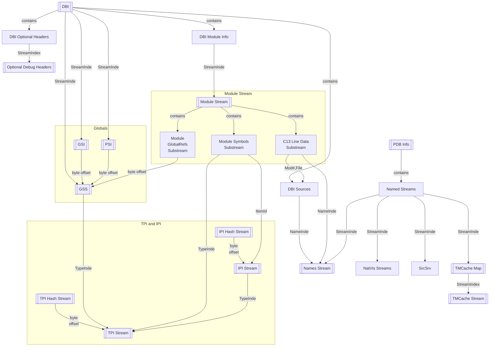

# Relationships between data: References 

Many of the data structures in PDBs are related to other each other. This can take many forms:

* Some streams contain stream indices of other streams.  If information is moved from one stream index to another (during a PDB rebuild), then the streams which pointed to the old stream numbers need to be updated to point to the new ones.
  + Example: The Debug Information (DBI) stream contains stream indices for Module Information streams, the Global Symbol Stream (GSS), the Global Symbol Index (GSI), etc.
  + Example: The PDB Information Stream contains stream indexes for named streams.
* Some records contain byte offsets that point into other streams.
  + Example: The GSI contains byte offsets that point into the contents of the GSS.
* Some records contain record indices that refer to records in other streams.
  + Example: Symbol records refer to type records using a TypeIndex.
* Some bounds (array sizes) or other parameters are stored in headers or separate streams.

For a PDB reader, these references are obviously needed to get the job done; it’s always obvious that you need to read the DBI before you can find the right stream that contains the GSI.

However, these references are much more important for apps that create or modify PDBs, because editing information may invalidate information. It is important to understand the relationships between all of the data in PDBs, so that the relationships can be preserved when creating or modifying PDBs. In some cases the edits desired are minor, such as adding a new NatVis XML file to an existing PDB. In other cases, like achieving determinism, we need a rigorous and formal approach to guarantee correctness. 

Formally, we define the reference graph of all data structures within a PDB. The reference graph is acyclic; it does not make sense for a data structure to depend on itself, directly or indirectly.

The reference graph allows us to reason about how to make changes to a PDB while preserving all the invariants of the PDB. The reference graph will answer questions, such as: If I change the order of the records in table T, what other tables do I need to update? And transitively, what other tables (indirect dependencies) do I need to update?

Achieving determinism requires a topology-walk through these dependencies in one direction.

This diagram illustrates many of the references that connect the modules, symbols, and types
data structures.

* Each node is a data structure.
* Edges represent pointers from one data structure to another, which need to be updated when
  the pointed-to data structure is modified.
* Double-boxed nodes represent streams.

References within nodes are _not_ shown. For example, the TPI Stream contains `TypeIndex` values,
which point into the TPI Stream. These self-edges are not shown in the diagram above, for the sake
of clarity.

